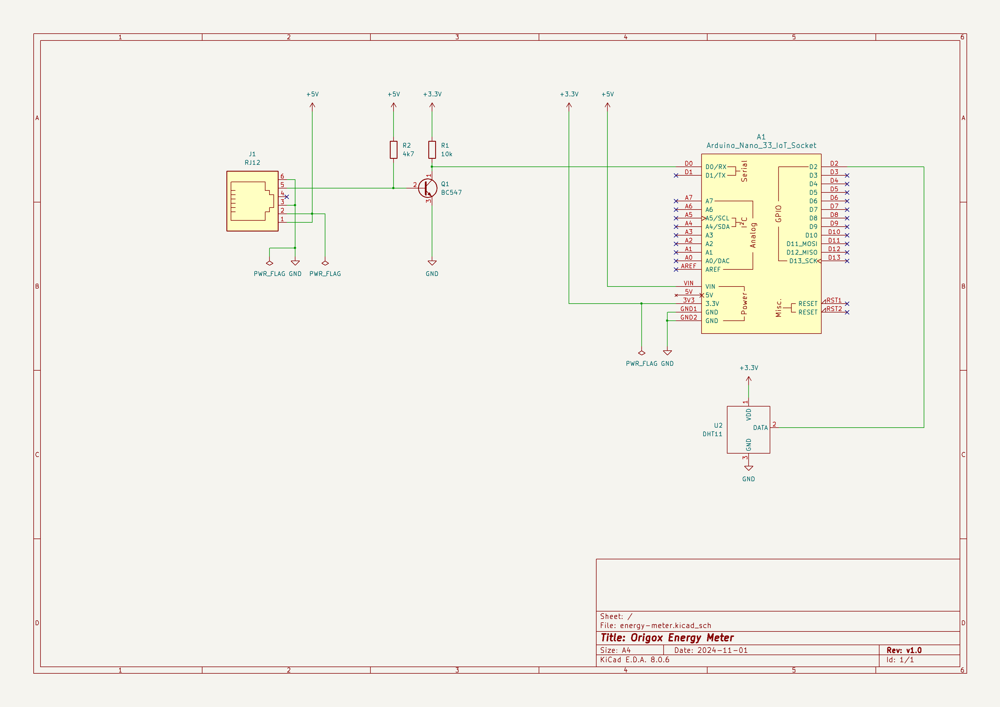

# Smart Energy Meter

A robust Arduino-based smart energy meter that reads P1 port data from smart electricity meters and publishes real-time energy consumption data via MQTT.

## Features

- **P1 Smart Meter Integration**: Reads OBIS protocol data from European smart meters via P1 port
- **Real-time Energy Monitoring**: Tracks electricity consumption, production, voltage, and current across multiple phases
- **MQTT Publishing**: Publishes structured data to MQTT broker for integration with home automation systems
- **WiFi Connectivity**: Non-blocking WiFi connection with automatic reconnection
- **Robust Error Handling**: Gracefully handles connection failures and continues operation
- **Comprehensive Data Parsing**: Extracts 25+ different energy measurements including:
  - Total energy usage and production (kWh)
  - Current power usage and production (kW)
  - Reactive energy measurements (kVAr)
  - Per-phase voltage, current, and power measurements
  - System timestamps

## Hardware Requirements

- **Arduino Nano 33 IoT** (ATmega4809 + WiFi module)
- **P1 Cable** for connecting to smart meter
- **Smart Meter** with P1 port (standard in Netherlands, Sweden, and other European countries)

### Custom P1 Adapter Board

This project includes a custom PCB design for interfacing the Arduino Nano 33 IoT with P1 smart meters. Originally designed for a Raspberry Pi Zero, the design was adapted for Arduino Nano 33 IoT due to significantly lower power consumption requirements.

- **KiCad Schematic**: [hanp1-rpi-zero-w.kicad_sch](assets/hanp1-rpi-zero-w.kicad_sch)
- **KiCad PCB Layout**: [hanp1-rpi-zero-w.kicad_pcb](assets/hanp1-rpi-zero-w.kicad_pcb)

The adapter board provides proper signal conditioning and isolation for safe connection between the P1 port and Arduino.

#### Schematic Diagram



### Smart Meter Compatibility

⚠️ **Important**: Before starting this project, verify that your smart meter has a P1 port and supports the OBIS protocol. Check your meter's documentation or contact your energy provider to confirm P1 compliance. Not all smart meters include P1 ports, and specifications may vary by country and manufacturer.

## Dependencies

This project uses PlatformIO and includes the following libraries:

```ini
arduino-libraries/WiFiNINA@^1.8.14
knolleary/PubSubClient@^2.8
arduino-libraries/Arduino_LSM6DS3@^1.0.3
adafruit/DHT sensor library@^1.4.6
adafruit/Adafruit Unified Sensor@^1.1.14
```

## Installation

1. **Clone the repository**:
   ```bash
   git clone <repository-url>
   cd energy-meter
   ```

2. **Configure secrets**: Copy and edit the secrets file:
   ```bash
   cp lib/ArduinoSecrets/arduino_secrets.h.bak lib/ArduinoSecrets/arduino_secrets.h
   ```

3. **Edit configuration**: Update `arduino_secrets.h` with your settings:
   ```cpp
   #define SECRET_SSID "your-wifi-ssid"
   #define SECRET_PASS "your-wifi-password"
   #define SECRET_MQTT_SERVER "your-mqtt-broker-ip"
   #define SECRET_MQTT_USERNAME "your-mqtt-username"
   #define SECRET_MQTT_PASSWORD "your-mqtt-password"
   ```

4. **Build and upload**:
   ```bash
   pio run -t upload
   ```

5. **Monitor output**:
   ```bash
   pio device monitor
   ```

## Configuration

### Hardware Setup

1. **Build the P1 adapter board** using the provided KiCad files (recommended) or connect P1 cable directly
2. **Connect P1 cable** to your smart meter's P1 port
3. **Connect the adapter board** to Arduino Nano 33 IoT Serial1 pins
4. **Power the Arduino** via USB or external supply

### MQTT Topics

The device publishes data to the following MQTT topics:

| Topic | Description | Unit |
|-------|-------------|------|
| `timestamp` | Smart meter timestamp | |
| `total_energy_usage` | Total energy consumed | kWh |
| `total_energy_returned` | Total energy produced | kWh |
| `current_power_usage` | Current power consumption | kW |
| `current_power_returned` | Current power production | kW |
| `voltage_phase1/2/3` | Voltage per phase | V |
| `current_phase1/2/3` | Current per phase | A |
| `status` | Device status | |
| `uptime` | Device uptime | seconds |

### Serial Communication

- **P1 Port**: 115200 baud (Serial1)
- **Debug Console**: 9600 baud (Serial)

## Architecture

### Core Components

- **Main Loop** (`src/main.cpp`): Non-blocking main application logic
- **OBIS Parser** (`lib/ObisParser/`): Parses P1 protocol data
- **MQTT Helper** (`lib/MqttHelper/`): Handles MQTT connections and publishing
- **WiFi Setup** (`lib/WiFiSetup/`): WiFi connection management
- **System Info** (`lib/SystemInfo/`): Device status reporting

### Data Flow

1. Arduino reads P1 data via Serial1 at 115200 baud
2. OBIS Parser extracts structured data from raw P1 telegram
3. MQTT Helper publishes parsed data to configured MQTT broker
4. Home automation systems can subscribe to MQTT topics

## Monitoring

### Status Indicators

- **WiFi Status**: Monitored every 30 seconds
- **MQTT Status**: Automatic reconnection with backoff
- **Heartbeat**: Status published every 30 seconds
- **P1 Data**: Real-time parsing and publishing

### Debugging

Enable verbose output in `platformio.ini`:
```ini
build_flags = -DDEBUG_MODE
```

## Troubleshooting

### Common Issues

1. **No P1 data**: Check cable connections and smart meter compatibility
2. **WiFi connection fails**: Verify SSID/password in `arduino_secrets.h`
3. **MQTT not connecting**: Check broker IP, credentials, and network access
4. **Data stops after 1 minute**: Ensure proper MQTT client type for your broker

### Recent Fixes Applied

This project has been thoroughly debugged and stabilized:

- ✅ Fixed WiFiClient type for non-SSL MQTT connections
- ✅ Added MQTT loop to main application loop
- ✅ Removed excessive debug publishing
- ✅ Implemented non-blocking connection handling
- ✅ Added robust error recovery

See `ANALYSIS.md` and `FIXES_APPLIED.md` for detailed fix documentation.

## Contributing

1. Fork the repository
2. Create a feature branch
3. Make your changes
4. Add tests if applicable
5. Submit a pull request

## License

[Add your license here]

## Acknowledgments

- P1 protocol specification from DSMR and European smart meter standards
- Arduino and PlatformIO communities
- MQTT.org for messaging protocol documentation